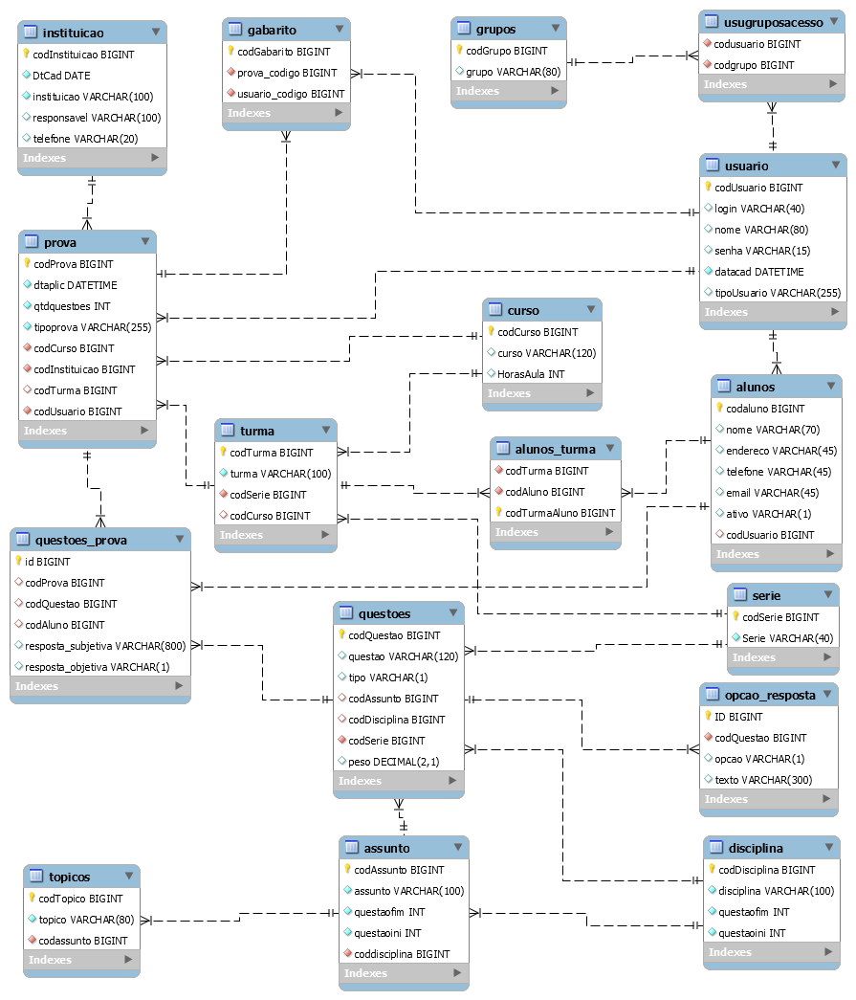

# Modelagem do prototipo do banco dados SCTEACHER

.(https://github.com/jaimesilvads/ModelagemDio/blob/main/ScriptCriacaoBancoSCTEACHER.sql)
### Esse tabalho não se propoe a ser uma solução completa para resolver o problema.

# Sobre o projeto
## Problema a ser resolvido:

O SCTEACHER permite a geração de provas de forma automatica com base numa configuração previa, onde você informa a quantidade de questoues por assunto e discipplina. Permitindo ao sistema ser capaz de segmentar a prova por Displina/Assunto, selecionando as questões de forma randomica com base na quantidade questões informada para cada prova, gerando uma prova diferente para cada aluno.

- ex: Disciplina - Ciência foi configurada com questoes  indo de e 1 a 4000 e esta subdividida em :
	1. Formação do universo de 1 a 200
	2. Sistema Solar de  201 a 400
	3. Constituição da Matéria 401 a 600

## Abaixo podemos ver a imagem do modelo de banco de dados:

(https://github.com/jaimesilvads/ModelagemDio/blob/main/ScriptCriacaoBancoSCTEACHER.sql)
